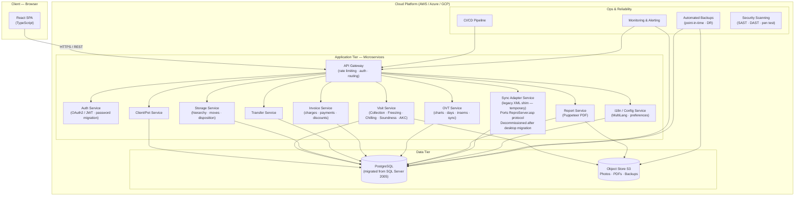

# Migration Estimate: BD-DSK → Cloud Web Application

---

**Prepared by:** Atomate Limited
**Registered in England and Wales. Reg No 07591946.**
**Date:** 30 March 2026
**Revised:** 3 April 2026

---

## Introduction

This document has been prepared by Atomate Limited at the request of the client and sets out a detailed technical assessment and effort estimate for migrating the BD-DSK desktop application to a modern cloud-hosted web platform.

The estimate covers all phases of delivery — from initial infrastructure and data migration through to core domain features, business functionality, quality assurance, and production deployment. It includes breakdown by development role, elapsed calendar time, and indicative labour costs, as well as an estimate of ongoing maintenance expenditure following go-live.

Atomate Limited has based this assessment on a thorough analysis of the existing BD-DSK codebase (~44,500 lines of code across 97 components), supporting documentation, the `database/` folder containing the full server-side ASP application and SQL Server database, and established benchmarks for projects of comparable scope and complexity. Where source components were unavailable for direct inspection, assumptions have been stated and flagged as risks.

This estimate is provided to assist in project planning and budgeting decisions. It is not a fixed-price quotation. Actual costs will depend on final scope, team composition, third-party dependencies, and decisions made during the project (see Key Decisions Required Before Starting).

---

## Disclosure

1. **Estimate basis.** All figures are indicative estimates based on the information available at the time of preparation. They represent professional judgement and should not be treated as contractual commitments or guarantees of cost or schedule.

2. **Scope assumptions.** This estimate incorporates feature-parity with the existing BD-DSK application plus the v1.0 scope extensions identified in `CanineRepro-Updates.docx` (practice short-code, label printing in workflow, Transfer In, pelleted semen, medical history profiles). AI-assisted semen evaluation and VMS integration from the same document are classified as v2.0 / separate workstreams and are not included in v1.0 financials. Any further change in scope will require a revised estimate.

3. **Third-party dependencies.** Costs and timelines associated with third-party services (including ovtvet.com OVT integration, cloud provider pricing, and external penetration testing) are outside Atomate Limited's control and are shown as indicative ranges only.

4. **Domain Expert.** This estimate assumes that a suitably qualified domain expert (veterinary reproductive medicine) will be made available by the client throughout Phases 1 and 2 at no charge to the project. Delay or unavailability of domain expertise is a schedule risk.

5. **Confidentiality.** This document contains commercially sensitive information prepared specifically for the named client. It should not be disclosed to third parties without the prior written consent of Atomate Limited.

6. **Liability.** Atomate Limited's liability in connection with this estimate is limited to the terms of any engagement agreement in place between Atomate Limited and the client. In the absence of such an agreement, this document is provided for information purposes only and Atomate Limited accepts no liability for decisions made in reliance upon it.

---

## Context

BD-DSK is a legacy VB6 desktop application (~44,500 LOC across 97 components) for managing canine reproductive services. The goal is to fully rewrite it as a cloud-hosted web application, replacing the Windows-only desktop + Access database model with a modern browser-based SPA, REST API microservices, and managed cloud database.

This is a **full rewrite**, not a port. VB6 UI layout code cannot be meaningfully converted; every screen must be redesigned.

**Revised context (April 2026):** Review of the `database/` folder reveals this is a **migration and modernisation** rather than a pure greenfield rewrite. A production server-side application already exists:

- `ReproServer.asp` (VBScript/IIS) — BD-DSK sync endpoint, last active May 2016, version 1.8.01
- `sync_web.asp` (PerlScript/IIS) — OVT sync endpoint with zlib compression
- ~20 read-only PerlScript/ASP pages covering client, pet, freezing, straw, storage, and transfer views
- A SQL Server 2005 `REPRO` database (~38MB MDF) — this is the server-authoritative schema, not the Access desktop cache
- Multi-user auth (`USERS` table with `GUID_USER` scoping) and multi-language infrastructure (`MultiLang`, `ListLanguages` — 7 languages) already exist in the SQL Server DB

Both sides of the sync protocol are present in this repository, eliminating the need to reverse-engineer the OVT/ReproServer API. The existing ASP pages serve as the **reference implementation and API specification** for each microservice. The existing ASP/Perl application will be decommissioned after the React SPA reaches feature parity.

---

## Existing Server-Side Assets (Reference Implementation)

The following assets exist today and inform the new architecture — they are **not** to be maintained or extended:

| Asset | Location | Role in new architecture |
|---|---|---|
| SQL Server 2005 `REPRO` database (~38MB MDF) | `database/_MSSQL_2005_DB/REPRO.mdf` | Migration source for schema and data |
| `ReproServer.asp` | `database/ReproServer.asp` | Spec for Sync Adapter Service (QUERY/UPLOAD/DOWNLOAD/DELETE over XML) |
| `mdlReproServer.asp` | `database/mdlReproServer.asp` | Shared logic: `db_xml_save`, `db_xml_load`, `db_xml_delete`, CRC, escape |
| `sync_web.asp` | `database/sync_web.asp` | Spec for OVT Service sync (RECLIST/UPDATERECS/DELETERECS, CRC32 + zlib) |
| ~20 PerlScript/ASP read-only pages | `database/*.asp` | SQL JOIN patterns = API spec for Client/Pet/Visit/Storage/Transfer services |
| `common.asp:dbStorageLocation()` | `database/common.asp:189` | Reference implementation for Storage Service location-path resolver |
| USERS table (SQL Server) | — | Foundation for Auth Service; plaintext passwords must be hashed on migration |
| MultiLang / ListLanguages tables | — | Seed data for i18n/Config Service (7 languages: EN, FR, IT, GER, ESP, SWE, ICE) |

---

## Proposed Target Architecture

| Layer | Technology |
|---|---|
| Frontend | React SPA + TypeScript |
| Backend | Microservices — Node.js / Express (one service per domain) |
| Database | PostgreSQL (migrated from SQL Server 2005 REPRO database) |
| Legacy sync shim | Sync Adapter Service — temporary XML-over-HTTP compatibility layer for VB6 desktop clients |
| File/image storage | S3-compatible object store |
| Cloud platform | AWS / Azure / GCP (provider-agnostic) |
| Auth | OAuth2 / JWT — ported from existing USERS/GUID_USER model; password hashing migration required |
| PDF reports | Puppeteer or server-side PDF library |
| Label printing | Browser print CSS + PDF generation |
| i18n | Standard i18n framework — seeded from existing MultiLang/ListLanguages tables |

**Microservice → domain mapping (from existing SQL queries in ASP pages):**

| Service | Tables | ASP reference |
|---|---|---|
| Auth | USERS | `register.asp`, `login_as.asp` |
| Client/Pet | CLIENTS, PETS, _BREED, _BREED_GROUP | `client_details.asp`, `pet_details.asp`, `view_pets.asp` |
| Visit | VISITS, AKC_FREEZINGS, AKC_CHILLINGS, AKC_FRESH | `view_freezings.asp`, `evaluation.asp` |
| Storage | STORAGE (self-referencing hierarchy) | `storage_report.asp`, `all_straws.asp`, `common.asp:dbStorageLocation` |
| Transfer | TRANSFERS, INSEMINATIONS | `view_transfers.asp`, `transfer_report.asp` |
| Invoice | INVOICES, CHARGES, PAYMENTS, SERVICES, DISCOUNT_GROUPS, DOCTORS | — |
| OVT | FORMS, DAYS, INSEMS, SYNC | `app_rep_iwdata.asp`, `app_rep_morphology.asp`, `app_due.asp` |
| Report | (reads all tables via dedicated queries) | `storage_report.asp`, `transfer_report.asp` |
| Sync Adapter | Wraps all services | `ReproServer.asp`, `mdlReproServer.asp` |
| i18n/Config | MultiLang, ListLanguages, MEMOS, VARS | `sync_web.asp:act_langlist`, `act_downloadlang` |

---

## Roles

| ID | Role | Responsibilities |
|---|---|---|
| PM | Project Manager | Coordination, sprint planning, stakeholder communication, risk tracking |
| ARC | Solution Architect | Tech stack decisions, API contracts, cloud infra design, security model, microservice boundaries |
| BE | Backend Developer | REST API microservices, business logic, DB queries, sync adapter |
| FE | Frontend Developer | React UI, forms, state management, report previews |
| DBA | Database Architect | Schema migration (SQL Server→PG), stored procedure migration, data migration scripts |
| QA | QA Engineer | Test cases, regression testing, UAT coordination |
| OPS | DevOps/Cloud Engineer | CI/CD, cloud infra (IaC), environments, monitoring |
| DOM | Domain Expert | Veterinary repro domain validation (can be a consultant or existing user) |

---

## Estimation Units

**PW = person-week (one person, one week)**
Elapsed time assumes a team working in parallel with realistic dependencies.
Estimates are ranges (optimistic–realistic). Use the realistic figure for planning.

> **All estimates assume AI coding assistance throughout (Claude Code / Copilot).** AI tooling yields an average ~30% reduction in person-weeks versus manual coding, with the largest gains on boilerplate CRUD (~50%), repetitive reports (~45%), and data migration scripts (~40%). Domain expert review, UAT, and OVT integration negotiation are unaffected.

---

## Phase 0 — Foundation (Elapsed: ~5 weeks)

| Component | BE | FE | DBA | OPS | ARC | PM | Notes |
|---|---|---|---|---|---|---|---|
| Cloud infrastructure, environments, CI/CD | — | — | — | 3 PW | 1 PW | 0.5 PW | Dev/Staging/Prod; IaC |
| Auth service (login, roles, sessions) | 1 PW | 0.5 PW | — | 0.5 PW | 1 PW | — | Port USERS/GUID_USER model from SQL Server; add JWT + password hashing; do not rebuild from scratch |
| Database schema design (PG) | 1 PW | — | 1.5 PW | — | 1 PW | — | SQL Server schema is queryable — no binary reverse-engineering needed |
| SQL Server → PostgreSQL migration scripts | — | — | 1.5 PW | — | — | — | Source is SQL Server with known schema; includes GUID handling and NULL semantics |
| SQL Server stored procedure migration | — | — | 0.5 PW | — | — | — | `DELETE_STORAGE` + any others in REPRO.mdf; port or replace logic |
| Plaintext password hashing migration | — | — | 0.5 PW | — | — | — | Hash all existing USERS passwords; prepare user password-reset notification |
| Data migration dry-run + validation | — | — | 1 PW | 0.5 PW | — | 0.5 PW | Run against real SQL Server DB (REPRO.mdf) |
| Shared UI component library | — | 2 PW | — | — | 0.5 PW | — | Design system, form patterns |
| Disaster recovery + backup strategy | — | — | — | 1.5 PW | 0.5 PW | — | RTO/RPO definition, automated snapshots, failover runbooks |
| Security architecture + hardening | 0.5 PW | — | — | — | 1 PW | — | Secrets management, encryption at rest/transit, RBAC design, OWASP baseline |
| **Phase 0 Total** | **2.5 PW** | **2.5 PW** | **5 PW** | **5.5 PW** | **5 PW** | **1 PW** | **~21.5 PW** |

---

## Phase 1 — Core Domain (Elapsed: ~10 weeks)

### 1.1 Client & Pet Management
*Forms: frClients, frPets, frEditClientPet, frSearchClientPet, frPetInfo (2,841 LOC)*
*ASP reference: `client_details.asp`, `pet_details.asp`, `view_pets.asp`*

| Task | BE | FE | QA | DOM |
|---|---|---|---|---|
| Client CRUD + search | 1 PW | 1.5 PW | 0.5 PW | — |
| Pet CRUD (breeds, pedigree, photos) | 1.5 PW | 2 PW | 0.5 PW | 0.5 PW |
| Pet detail view (visits/invoices/straws tabs) | 1 PW | 2 PW | 0.5 PW | — |
| Practice short-code / access URL (e.g. clinic.caninerepro.com/smith) | 0.5 PW | 0.5 PW | — | — |
| **Subtotal** | **4 PW** | **6 PW** | **1.5 PW** | **0.5 PW** | **= 12 PW** |

### 1.2 Semen Collection Visit
*Forms: frVisits, frEditVisit (3,787 LOC), frAKCFreezing (1,684), frAKCChilling (1,548), frAKCFresh (1,512)*
*ASP reference: `view_freezings.asp`, `evaluation.asp`, `evaluations.asp`*
*Most complex single feature in the codebase.*

| Task | BE | FE | QA | DOM |
|---|---|---|---|---|
| Visit list + filtering | 0.5 PW | 1 PW | 0.5 PW | — |
| Collection tab | 1 PW | 2 PW | 0.5 PW | 1 PW |
| Freezing tab + abnormalities + extenders | 2 PW | 3 PW | 1 PW | 1 PW |
| Chilling tab (send-to, insemination instructions) | 1 PW | 1.5 PW | 0.5 PW | 0.5 PW |
| Soundness tab (testes measurements) | 1 PW | 1.5 PW | 0.5 PW | 1 PW |
| AKC sub-forms (Freezing / Chilling / Fresh) | 2 PW | 2 PW | 1 PW | 2 PW |
| Label printing triggered from Freezing tab | 0.5 PW | 0.5 PW | — | — |
| Male collection problem recording (blood, ultrasound quality, corrective steps) | 0.5 PW | 1 PW | — | 0.5 PW |
| **Subtotal** | **8.5 PW** | **12.5 PW** | **4 PW** | **6 PW** | **= 31 PW** |

### 1.3 Cryogenic Storage Management
*Forms: frStorage (54 LOC), frStorageMove (127 LOC), frTankPopulate (175 LOC), StorageTree UserControl*
*ASP reference: `storage_report.asp`, `all_straws.asp`, `common.asp:dbStorageLocation()`*

| Task | BE | FE | QA | DOM |
|---|---|---|---|---|
| Storage tree API (hierarchy queries) | 2 PW | — | 0.5 PW | — |
| Interactive storage tree UI | — | 3 PW | 1 PW | 0.5 PW |
| Tank populate wizard | 0.5 PW | 1 PW | 0.5 PW | — |
| Move straws (suggestions algorithm) | 1 PW | 1.5 PW | 0.5 PW | 0.5 PW |
| **Subtotal** | **3.5 PW** | **5.5 PW** | **2.5 PW** | **1 PW** | **= 12.5 PW** |

### 1.4 Transfer & Disposition
*Forms: frTransfer (1,615 LOC), frAddStraws, frDisposition, frOVTInseminations*
*ASP reference: `view_transfers.asp`, `transfer_report.asp`*

#### Transfer Out (existing VB6 feature)

| Task | BE | FE | QA | DOM |
|---|---|---|---|---|
| Transfer CRUD + straw assignment | 2 PW | 2.5 PW | 1 PW | 0.5 PW |
| Disposition + insemination link | 1 PW | 1.5 PW | 0.5 PW | 0.5 PW |

#### Transfer In (new — from CanineRepro-Updates.docx)

Receiving semen (straws or pellets) from another practice. Records sender practice, semen quality on receipt, intended use, client and female details, planned breeding date, AKC registration paperwork.

| Task | BE | FE | QA | DOM |
|---|---|---|---|---|
| Transfer In data model + API | 1 PW | — | 0.5 PW | 0.5 PW |
| Transfer In UI (receive, record quality, link to female/client) | 0.5 PW | 2 PW | — | — |

| **Subtotal** | **4.5 PW** | **6 PW** | **2 PW** | **1.5 PW** | **= 14 PW** |

### 1.5 Pelleted Semen Workflow (new — from CanineRepro-Updates.docx)

Elevates the hidden "Use pelleted semen" VB6 preference to a first-class navigation section. Includes a dedicated Pellets screen, data model distinct from straws (form factor, quantity unit, thawing protocol), and mode-switching in the freezing workflow.

| Task | BE | FE | QA | DOM |
|---|---|---|---|---|
| Pellet data model + API (separate from STORAGE straws) | 1 PW | — | 0.5 PW | 0.5 PW |
| "Pelleted" navigation item + screens | — | 1.5 PW | — | — |
| Freezing ↔ Pelleted mode toggle | 0.5 PW | 0.5 PW | — | — |
| Receiving pellets from external practice (links to Transfer In) | 0.5 PW | 0.5 PW | — | — |
| **Subtotal** | **2 PW** | **2.5 PW** | **0.5 PW** | **0.5 PW** | **= 5.5 PW** |

### 1.6 Medical History Profiles (new — from CanineRepro-Updates.docx)

Structured per-animal health history beyond what is captured in visit records. Males: ultra-semen quality notes, collection problems, corrective steps, breeding history. Females: heat cycle outcomes, whether bred, pregnancy result, breeder quality notes (stood well, etc.), lab work from medical exams. Female cycle data overlaps with OVT; this covers the non-OVT structured notes.

| Task | BE | FE | QA | DOM |
|---|---|---|---|---|
| Male health history (lab work, collection problems, corrective steps) | 1 PW | 1.5 PW | 0.5 PW | 0.5 PW |
| Female breeding history (cycle outcomes, breeder quality, stood/didn't stand) | 1 PW | 1 PW | 0.5 PW | 0.5 PW |
| **Subtotal** | **2 PW** | **2.5 PW** | **1 PW** | **1 PW** | **= 6.5 PW** |

**Phase 1 Total: ~69 PW**

---

## Phase 2 — Business Features (Elapsed: ~10 weeks)

### 2.1 Invoicing & Billing
*Forms: frEditInvoice (350 LOC), frStorageInvoices (917 LOC), frEditCharge (411), frEditChargeTemplate (399), frDiscountGroups, frPayment, frServices*

| Task | BE | FE | QA |
|---|---|---|---|
| Service catalog + charge templates | 1 PW | 1.5 PW | 0.5 PW |
| Invoice creation + line items + discounts | 2 PW | 2.5 PW | 1 PW |
| Payment recording + balance calc | 1 PW | 1 PW | 0.5 PW |
| Storage billing module | 1.5 PW | 2 PW | 0.5 PW |
| **Subtotal** | **5.5 PW** | **7 PW** | **2.5 PW** | **= 15 PW** |

### 2.2 Report Generation (20 reports)
*All rp\* files: invoices, clients, pets, storage, transfers, visits, chilling, freezing (×3), soundness (×2), AKC, collection, label, storage map*

Each report = server-side PDF generation (Puppeteer or equiv.) + UI preview.
Average: 2.5d BE + 2d FE per report. Parallelisable across 2 developers.

| Report group | BE | FE | QA |
|---|---|---|---|
| Client & Pet reports (3) | 1.5 PW | 1 PW | 0.5 PW |
| Visit & Collection reports (3) | 2 PW | 1.5 PW | 0.5 PW |
| Freezing & Chilling reports (5) | 3 PW | 2 PW | 1 PW |
| Storage & Transfer reports (4) | 2 PW | 1.5 PW | 0.5 PW |
| Invoice & billing reports (3) | 1.5 PW | 1 PW | 0.5 PW |
| Soundness & AKC reports (2) | 1 PW | 1 PW | 0.5 PW |
| Report setup (clinic header, logo, memos) | 1 PW | 1.5 PW | 0.5 PW |
| **Subtotal** | **12 PW** | **9.5 PW** | **4 PW** | **= 25.5 PW** |

### 2.3 OVT Integration
*Ovt_fmMain (2,442 LOC), Ovt_frStat (1,257 LOC), Ovt_frSync (610 LOC), mdlOvtFunc (236 LOC)*
*ASP reference: `sync_web.asp`, `app_rep_iwdata.asp`, `app_rep_morphology.asp`, `app_rep_prates.asp`, `app_due.asp`*
*Full sync server source is present in `database/` folder — sync protocol is fully understood (R2 resolved).*

| Task | BE | FE | QA | DOM |
|---|---|---|---|---|
| OVT chart CRUD (FORMS, DAYS, INSEMS tables) | 2 PW | 3 PW | 1 PW | 2 PW |
| Cycle grid (daily progesterone/LH/cytology) | 2 PW | 3 PW | 1 PW | 1 PW |
| Who's Due + statistics reports | 1 PW | 2 PW | 0.5 PW | 1 PW |
| OVT ↔ BD-DSK link (pet↔chart, disposition↔insemination) | 1.5 PW | 1 PW | 1 PW | 0.5 PW |
| OVT sync reimplementation (protocol known from `sync_web.asp`) | 1.5 PW | 1 PW | 1 PW | — |
| **Subtotal** | **8 PW** | **10 PW** | **4.5 PW** | **4.5 PW** | **= 27 PW** |

**Phase 2 Total: ~67.5 PW**

---

## Phase 5 — v2.0 Extended Features (Out of Scope for v1.0)

The following features from `CanineRepro-Updates.docx` require significant new capabilities beyond feature parity. They are not included in the v1.0 financial estimate. Each should be scoped as a separate engagement after the core migration is stable.

| Feature | Approx. Effort | Key constraints |
|---|---|---|
| **AI-assisted semen evaluation** — photo-based morphological analysis, concentration, motility (1–5), velocity and movement pattern scoring | ~12 PW (BE 4, FE 3, ARC 1, QA 2, DOM 2) | Cloud AI vision API or custom model; clinical validation by veterinary reproductive specialist required before use in practice; high accuracy bar |
| **VMS integration** — embed CR repro workflows into existing clinic management software (AVImark, Cornerstone, ezyVet, ImproMed) | ~5–8 PW per platform + ARC 2 PW for integration architecture | Each VMS has a different API; some require HL7 or file import; vendor agreements may be needed |
| **Phase 5 Total (indicative)** | **~17–20 PW (first platform)** | Not included in v1.0 financials or elapsed time |

---

## Phase 3 — Supporting Features (Elapsed: ~7 weeks)

| Component | BE | FE | QA | OPS | Notes |
|---|---|---|---|---|---|
| Sync Adapter Service (legacy XML shim + new REST) | 2.5 PW | 1 PW | 1.5 PW | 1 PW | Ports `ReproServer.asp` QUERY/UPLOAD/DOWNLOAD/DELETE to REST; decommissioned after all clinics migrate |
| Multi-language / i18n | 0.5 PW | 1.5 PW | 1 PW | — | Seeded from existing MultiLang/ListLanguages SQL Server tables (7 languages) |
| Pet photos / logo upload (cloud storage) | 1 PW | 1.5 PW | 0.5 PW | 0.5 PW | S3 integration |
| Label printing (frLabelFormats + frEditLabelFormat) | 1.5 PW | 2.5 PW | 1 PW | — | Browser print CSS is complex |
| Backup / restore + XML import/export | 1 PW | 1 PW | 0.5 PW | 0.5 PW | frBakRestore, frXMLImpExp |
| Licensing / subscription model | 1 PW | 1 PW | 0.5 PW | 0.5 PW | Replaces mdlRegistration.bas key.txt model |
| Preferences / options | 0.5 PW | 1 PW | 0.5 PW | — | frPreferences, frOptions |
| Breed management + import | 0.5 PW | 0.5 PW | 0.5 PW | — | _BREED, _BREED_GROUP, ProcessBreeds |
| **Phase 3 Total** | **8.5 PW** | **10 PW** | **6 PW** | **2.5 PW** | **= 27 PW** |

---

## Phase 4 — QA, UAT & Deployment (Elapsed: ~5 weeks)

| Task | BE | FE | QA | OPS | PM | DOM |
|---|---|---|---|---|---|---|
| Integration test suite | 2 PW | 1 PW | 3 PW | — | — | — |
| Performance testing + query optimisation | 1 PW | — | 1 PW | 1 PW | — | — |
| UAT with real users (clinic staff) | — | 0.5 PW | 2 PW | — | 1 PW | 2 PW |
| Production deployment + runbooks | — | — | — | 2 PW | 0.5 PW | — |
| Data migration: live SQL Server databases | — | — | 1 PW | 1 PW | 1 PW | — |
| ASP web portal cutover + decommission | 0.5 PW | — | 0.5 PW | 0.5 PW | 0.5 PW | — |
| Penetration test remediation | 1 PW | — | — | — | 0.5 PW | — | External pen test is a fixed-cost engagement (~$10–15k); this covers in-house remediation of findings |
| **Phase 4 Total** | **4.5 PW** | **1.5 PW** | **7.5 PW** | **4.5 PW** | **3.5 PW** | **2 PW** | **~23.5 PW** |

---

## Summary by Role

| Role | Person-Weeks | Notes |
|---|---|---|
| Backend Developer (×2 recommended) | **34–38 PW** | ~17–19 PW per developer; +6 PW from Transfer In, Pellets, Medical History, short-code, label printing |
| Frontend Developer (×2 recommended) | **32–35 PW** | ~16–18 PW per developer; +6–7 PW from new v1.0 scope |
| Database Architect | **7–8 PW** | SQL Server SP inspection offsets Access reverse-engineering saving |
| QA Engineer | **23–25 PW** | +2 PW for new v1.0 features |
| DevOps / Cloud | **12 PW** | Heavy at start (infra + DR) and end (deployment + cutover) |
| Solution Architect | **8 PW** | Front-loaded; includes microservice design, DR and security architecture |
| Project Manager | **4.5 PW** | Throughout |
| Domain Expert | **17–18 PW** | +2.5–3.5 PW for Pellets, Medical History, Transfer In clinical validation; client-provided |
| **TOTAL** | **~139–149 PW** | |

---

## Elapsed Time Estimate

With a team of **8 people** (2 BE, 2 FE, 1 DBA, 1 QA, 0.5 OPS, 0.5 DOM) working in parallel:

| Phase | Elapsed |
|---|---|
| Phase 0 — Foundation | 5 weeks |
| Phase 1 — Core Domain | 10 weeks |
| Phase 2 — Business Features | 10 weeks |
| Phase 3 — Supporting Features | 7 weeks |
| Phase 4 — QA & Deployment | 5 weeks |
| **Total Elapsed** | **~37 weeks** |

Adding 20% buffer for coordination overhead, unexpected complexity, and domain clarifications: **10–12 months**.

> AI tooling compresses individual coding tasks but does not reduce coordination, domain review, QA cycles, or the Sync Adapter integration — these remain the schedule bottlenecks.

---

## Financial Estimate

Rates used (day rate × 5 days = weekly rate):

| Role | Day Rate | Week Rate |
|---|---|---|
| Backend Developer | $360/day | $1,800/wk |
| Frontend Developer | $360/day | $1,800/wk |
| Database Architect | $375/day | $1,875/wk |
| QA Engineer | $280/day | $1,400/wk |
| DevOps / Cloud | $375/day | $1,875/wk |
| Solution Architect | $450/day | $2,250/wk |
| Project Manager | $375/day | $1,875/wk |
| Domain Expert | — | $0 (client-provided) |

| Role | Person-Weeks | Day Rate | Week Rate | Cost Range |
|---|---|---|---|---|
| Backend Developer (×2) | 34–38 PW | $360 | $1,800 | $61,200–$68,400 |
| Frontend Developer (×2) | 32–35 PW | $360 | $1,800 | $57,600–$63,000 |
| Database Architect | 7–8 PW | $375 | $1,875 | $13,125–$15,000 |
| QA Engineer | 23–25 PW | $280 | $1,400 | $32,200–$35,000 |
| DevOps / Cloud | 12 PW | $375 | $1,875 | $22,500 |
| Solution Architect | 8 PW | $450 | $2,250 | $18,000 |
| Project Manager | 4.5 PW | $375 | $1,875 | $8,438 |
| Domain Expert | 17–18 PW | — | $0 | $0 (client-provided) |
| **Labour subtotal** | **~139–149 PW** | | | **~$213,000–$230,000** |
| Penetration test (external engagement) | — | — | — | ~$10,000–$15,000 |
| **TOTAL** | | | | **~$223,000–$245,000** |

> Labour figures cover contractor/consultant costs only. Cloud infrastructure, third-party licenses (e.g. Puppeteer/PDF library, S3, CI/CD tooling), and contingency reserves are not included. A 15–20% contingency on the labour cost is recommended given the MEDIUM-HIGH overall risk rating.

---

## Ongoing Maintenance Estimate

Assumes the system is in stable production. Developers handle monitoring and incident response — no dedicated SRE or support team.

### Monthly Staffing

| Role | FTE | Day Rate | Monthly Cost | Responsibilities |
|---|---|---|---|---|
| Backend Developer | 0.5 | $360 | $3,960 | Bug fixes, security patches, minor features, API monitoring |
| Frontend Developer | 0.25 | $360 | $1,980 | UI bugs, browser compatibility, minor UX changes |
| DevOps / Cloud | 0.25 | $375 | $2,063 | Infra monitoring, cost optimization, backup verification, deployments |
| QA Engineer | 0.1 | $280 | $616 | Regression testing patches before release |
| **Labour subtotal** | **1.1 FTE** | | **~$8,620/month** | |

*Monthly FTE cost = day rate × 22 working days × FTE fraction.*

### Monthly Cloud Infrastructure

| Component | Estimated Cost |
|---|---|
| PostgreSQL (RDS Multi-AZ, db.t3.medium) | $150–$250 |
| Application servers (microservices, auto-scaling) | $150–$300 |
| API Gateway | $30–$50 |
| Load balancer | $25 |
| S3 storage (photos, PDFs, backups) | $20–$50 |
| CDN (CloudFront) | $15 |
| Monitoring & alerting | $50–$100 |
| Automated database snapshots | $30–$50 |
| CI/CD tooling | $30–$50 |
| **Infra subtotal** | **~$500–$890/month** |

### Annual Totals

| Item | Annual Cost |
|---|---|
| Labour (1.1 FTE) | ~$103,440 |
| Cloud infrastructure | ~$6,000–$10,700 |
| **Total ongoing cost** | **~$109,000–$114,000/year** |

> These figures assume a stable, post-launch system with low change velocity. A period of active post-launch stabilization (first 3 months) will typically run at higher staffing — closer to 2 FTE — before settling to maintenance levels. Annual penetration testing retests (~$5,000–$8,000) should also be budgeted.

---

## Risk Register

| # | Risk | Likelihood | Impact | Adjusted effort | Mitigation |
|---|---|---|---|---|---|
| R1 | **Missing shared library source** — `DbTable`, `DBListView`, `Sizer` etc. are not in the repository; their full behaviour must be reverse-engineered | High | High | +3–5 PW BE | Systematically exercise each control in the running VB6 app and document behaviour before starting |
| R2 | **OVT external dependency** — ~~ovtvet.com is a separate product; integration scope is unknown without their API documentation~~ **RESOLVED** — Complete server-side sync code (`sync_web.asp`, `mdlReproServer.asp`) is present in `database/` folder. Protocol is fully understood. | ~~High~~ **Low** | ~~High~~ **Low** | **0 PW** | Both sides of the sync protocol are in this repository. |
| R3 | **SQL Server data quality** — real client data in `REPRO.mdf` may have constraint violations, orphaned GUIDs, or data the schema doesn't expect | Medium | High | +2–4 PW DBA | Run migration scripts against the actual `REPRO.mdf` in Phase 0 dry-run |
| R4 | **Domain knowledge gap** — veterinary reproductive medicine is specialised; incorrect business logic is not obvious to developers | High | High | +3–5 PW DOM | Domain Expert must be available throughout Phases 1–2, not just at review milestones |
| R5 | **No existing tests** — the VB6 codebase has zero automated tests; behaviour must be validated by running the original app | High | Medium | +4–6 PW QA | Build a manual test script from the VB6 app before migrating each module |
| R6 | **Report complexity** — 20 reports include SHAPE hierarchical recordsets and computed fields; equivalent PDF generation is non-trivial | Medium | Medium | +3–4 PW BE | Prototype the most complex report (rpFreezingStorage) first; validate PDF accuracy with domain expert |
| R7 | **Label printing in browser** — CSS print layout and label-format templates are notoriously unreliable cross-browser | Medium | Medium | +1–2 PW FE | Prototype early with a print-to-PDF approach using server-side rendering |
| R8 | **Multi-language infrastructure** — migrating 1,000+ strings to a standard i18n framework requires exhaustive string inventory | Low | Low | +0.5 PW | MultiLang/ListLanguages tables in SQL Server are the seed data; automate extraction |
| R9 | **Scope creep from modernisation** — stakeholders may request features not in the VB6 app (mobile UX, notifications, dashboards) | Medium | Medium | +variable | Strictly freeze scope to parity with existing features for v1.0 |
| R10 | **Plaintext passwords in USERS table** — passwords stored and compared in plaintext SQL (`WHERE PASSWORD='...'`) | Confirmed | Medium | +0.5 PW DBA | Migration script must hash all existing passwords (bcrypt); all existing web-portal users require a password-reset notification; cannot be deferred post-launch |
| R11 | **SQL Server stored procedures** — `EXEC DELETE_STORAGE` is called from `sync_web.asp`; additional SPs may exist in `REPRO.mdf` | Medium | Medium | +1 PW DBA | Enumerate all SPs by inspecting the SQL Server DB before designing PostgreSQL schema; port or replace each one |
| R12 | **Existing ASP web portal cutover** — clinics currently using the read-only ASP web portal need a clear cutover plan | Medium | Medium | +1–2 PW | React SPA must reach full read-only feature parity before ASP is decommissioned; communicate cutover date to all registered users |
| R13 | **AI semen evaluation accuracy** — AI-based morphological analysis of semen images requires clinical validation before use in clinical decisions | High | High | Deferred to v2.0 | Must be validated by a board-certified veterinary reproductive specialist; misclassification could lead to incorrect breeding decisions. Recommend a formal validation study as a pre-condition of v2.0 scoping |

**Overall project risk: MEDIUM-HIGH** — R2 is now resolved (sync protocol is in-repo); SQL Server schema is accessible. Remaining risks are R1 (missing VB6 shared library), R4 (domain knowledge), and R10/R11 (data migration quality).

---

## Key Decisions Required Before Starting

1. **OVT scope**: Will the new app replace the OVT web sync, integrate with it via the existing protocol (now fully understood), or drop OVT entirely? The protocol is known — this is now a build/no-build decision, not a discovery risk.
2. **Mobile targets**: PocketPC/Palm sync is obsolete. Replacing with a responsive web UI is assumed. Confirm no native mobile app is required.
3. **Multi-clinic / multi-user**: The existing SQL Server DB already has `GUID_USER` per-clinic data scoping. Confirm whether the new system uses the same model or requires full multi-tenancy (separate schemas per clinic).
4. **Data migration**: Are all existing SQL Server data from all registered clinics being migrated, or is this greenfield for new installations only?
5. **Shared library source**: Can the original developer provide source for `DbTable`, `DBListView`, `Sizer`, etc.? Critical for understanding VB6 edge cases.
6. **Hard cutover from ASP**: The existing ASP/Perl web application will be treated as a **reference implementation only** and decommissioned once the React SPA reaches feature parity with its read-only views. The VB6 desktop app will require a **temporary XML compatibility shim** (Sync Adapter Service) during the transition window until all clinics migrate to the web client. Confirm the acceptable transition window duration.
7. **AI semen evaluation scope**: The AI-assisted semen evaluation feature (photo-based morphological analysis, motility scoring, velocity patterns) is classified as v2.0. Before scoping it for implementation, a clinical validation protocol and regulatory/liability review are required. Recommend commissioning a feasibility assessment as a separate engagement. Confirm whether this is a priority for v2.0 or indefinitely deferred.
8. **VMS integration targets**: Which veterinary management systems (AVImark, Cornerstone, ezyVet, ImproMed, etc.) should be integrated, and in what order? Each platform is a separate integration workstream (~5–8 PW each). Recommend identifying the 2–3 most common systems used by the target clinic base before scoping v2.0.
