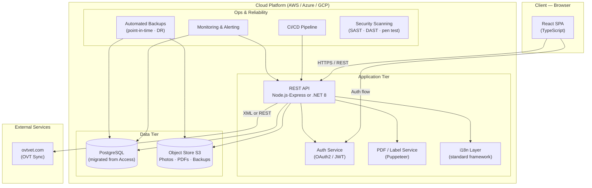

# Migration Estimate: BD-DSK → Cloud Web Application

---

**Prepared by:** Atomate Limited
**Registered in England and Wales. Reg No 07591946.**
**Date:** 30 March 2026

---

## Introduction

This document has been prepared by Atomate Limited at the request of the client and sets out a detailed technical assessment and effort estimate for migrating the BD-DSK desktop application to a modern cloud-hosted web platform.

The estimate covers all phases of delivery — from initial infrastructure and data migration through to core domain features, business functionality, quality assurance, and production deployment. It includes breakdown by development role, elapsed calendar time, and indicative labour costs, as well as an estimate of ongoing maintenance expenditure following go-live.

Atomate Limited has based this assessment on a thorough analysis of the existing BD-DSK codebase (~44,500 lines of code across 97 components), supporting documentation, and established benchmarks for projects of comparable scope and complexity. Where source components were unavailable for direct inspection, assumptions have been stated and flagged as risks.

This estimate is provided to assist in project planning and budgeting decisions. It is not a fixed-price quotation. Actual costs will depend on final scope, team composition, third-party dependencies, and decisions made during the project (see Key Decisions Required Before Starting).

---

## Disclosure

1. **Estimate basis.** All figures are indicative estimates based on the information available at the time of preparation. They represent professional judgement and should not be treated as contractual commitments or guarantees of cost or schedule.

2. **Scope assumptions.** This estimate assumes a feature-parity rewrite of the existing BD-DSK application. It does not include new features, integrations, or platforms beyond those documented herein. Any change in scope will require a revised estimate.

3. **Third-party dependencies.** Costs and timelines associated with third-party services (including ovtvet.com OVT integration, cloud provider pricing, and external penetration testing) are outside Atomate Limited's control and are shown as indicative ranges only.

4. **Domain Expert.** This estimate assumes that a suitably qualified domain expert (veterinary reproductive medicine) will be made available by the client throughout Phases 1 and 2 at no charge to the project. Delay or unavailability of domain expertise is a schedule risk.

5. **Confidentiality.** This document contains commercially sensitive information prepared specifically for the named client. It should not be disclosed to third parties without the prior written consent of Atomate Limited.

6. **Liability.** Atomate Limited's liability in connection with this estimate is limited to the terms of any engagement agreement in place between Atomate Limited and the client. In the absence of such an agreement, this document is provided for information purposes only and Atomate Limited accepts no liability for decisions made in reliance upon it.

---

## Context

BD-DSK is a legacy VB6 desktop application (~44,500 LOC across 97 components) for managing canine reproductive services. The goal is to fully rewrite it as a cloud-hosted web application, replacing the Windows-only desktop + Access database model with a modern browser-based SPA, REST API, and managed cloud database.

This is a **full rewrite**, not a port. VB6 UI layout code cannot be meaningfully converted; every screen must be redesigned.

---

## Proposed Target Architecture

| Layer | Technology |
|---|---|
| Frontend | React (SPA) + TypeScript |
| Backend API | Node.js / Express or .NET 8 Web API |
| Database | PostgreSQL (migrated from Access) |
| File/image storage | S3-compatible object store |
| Cloud platform | AWS / Azure / GCP (provider-agnostic) |
| Auth | OAuth2 / JWT (replaces no-auth desktop model) |
| PDF reports | Puppeteer or server-side PDF library |
| Label printing | Browser print CSS + PDF generation |
| i18n | Standard i18n framework (replaces custom mdlTranslate) |

---

## Roles

| ID | Role | Responsibilities |
|---|---|---|
| PM | Project Manager | Coordination, sprint planning, stakeholder communication, risk tracking |
| ARC | Solution Architect | Tech stack decisions, API contracts, cloud infra design, security model |
| BE | Backend Developer | REST API, business logic, DB queries, sync engine |
| FE | Frontend Developer | React UI, forms, state management, report previews |
| DBA | Database Architect | Schema migration (Access→PG), data migration scripts, query optimisation |
| QA | QA Engineer | Test cases, regression testing, UAT coordination |
| OPS | DevOps/Cloud Engineer | CI/CD, cloud infra (IaC), environments, monitoring |
| DOM | Domain Expert | Veterinary repro domain validation (can be a consultant or existing user) |

---

## Estimation Units

**PW = person-week (one person, one week)**
Elapsed time assumes a team working in parallel with realistic dependencies.
Estimates are ranges (optimistic–realistic). Use the realistic figure for planning.

> **All estimates assume AI coding assistance throughout (Claude Code / Copilot).** AI tooling yields an average ~30% reduction in person-weeks versus manual coding, with the largest gains on boilerplate CRUD (~50%), repetitive reports (~45%), and data migration scripts (~40%). Domain expert review, UAT, and OVT integration negotiation are unaffected.

---

## Phase 0 — Foundation (Elapsed: ~5 weeks)

| Component | BE | FE | DBA | OPS | ARC | PM | Notes |
|---|---|---|---|---|---|---|---|
| Cloud infrastructure, environments, CI/CD | — | — | — | 3 PW | 1 PW | 0.5 PW | Dev/Staging/Prod; IaC |
| Auth system (login, roles, sessions) | 2 PW | 1 PW | — | 0.5 PW | 1 PW | — | New feature — VB6 has no auth |
| Database schema design (PG) | 1 PW | — | 2 PW | — | 1 PW | — | 25 tables + views + indexes |
| Access → PostgreSQL migration scripts | — | — | 3 PW | — | — | — | GUID handling, Access quirks |
| Data migration dry-run + validation | — | — | 2 PW | 0.5 PW | — | 0.5 PW | Run against real client DBs |
| Shared UI component library | — | 2 PW | — | — | 0.5 PW | — | Design system, form patterns |
| Disaster recovery + backup strategy | — | — | — | 1.5 PW | 0.5 PW | — | RTO/RPO definition, automated snapshots, failover runbooks |
| Security architecture + hardening | 0.5 PW | — | — | — | 1 PW | — | Secrets management, encryption at rest/transit, RBAC design, OWASP baseline |
| **Phase 0 Total** | **3.5 PW** | **3 PW** | **7 PW** | **5.5 PW** | **5 PW** | **1 PW** | **~25 PW** |

---

## Phase 1 — Core Domain (Elapsed: ~10 weeks)

### 1.1 Client & Pet Management
*Forms: frClients, frPets, frEditClientPet, frSearchClientPet, frPetInfo (2,841 LOC)*

| Task | BE | FE | QA | DOM |
|---|---|---|---|---|
| Client CRUD + search | 1 PW | 1.5 PW | 0.5 PW | — |
| Pet CRUD (breeds, pedigree, photos) | 1.5 PW | 2 PW | 0.5 PW | 0.5 PW |
| Pet detail view (visits/invoices/straws tabs) | 1 PW | 2 PW | 0.5 PW | — |
| **Subtotal** | **3.5 PW** | **5.5 PW** | **1.5 PW** | **0.5 PW** | **= 11 PW** |

### 1.2 Semen Collection Visit
*Forms: frVisits, frEditVisit (3,787 LOC), frAKCFreezing (1,684), frAKCChilling (1,548), frAKCFresh (1,512)*
*Most complex single feature in the codebase.*

| Task | BE | FE | QA | DOM |
|---|---|---|---|---|
| Visit list + filtering | 0.5 PW | 1 PW | 0.5 PW | — |
| Collection tab | 1 PW | 2 PW | 0.5 PW | 1 PW |
| Freezing tab + abnormalities + extenders | 2 PW | 3 PW | 1 PW | 1 PW |
| Chilling tab (send-to, insemination instructions) | 1 PW | 1.5 PW | 0.5 PW | 0.5 PW |
| Soundness tab (testes measurements) | 1 PW | 1.5 PW | 0.5 PW | 1 PW |
| AKC sub-forms (Freezing / Chilling / Fresh) | 2 PW | 2 PW | 1 PW | 2 PW |
| **Subtotal** | **7.5 PW** | **11 PW** | **4 PW** | **5.5 PW** | **= 28 PW** |

### 1.3 Cryogenic Storage Management
*Forms: frStorage (54 LOC), frStorageMove (127 LOC), frTankPopulate (175 LOC), StorageTree UserControl*

| Task | BE | FE | QA | DOM |
|---|---|---|---|---|
| Storage tree API (hierarchy queries) | 2 PW | — | 0.5 PW | — |
| Interactive storage tree UI | — | 3 PW | 1 PW | 0.5 PW |
| Tank populate wizard | 0.5 PW | 1 PW | 0.5 PW | — |
| Move straws (suggestions algorithm) | 1 PW | 1.5 PW | 0.5 PW | 0.5 PW |
| **Subtotal** | **3.5 PW** | **5.5 PW** | **2.5 PW** | **1 PW** | **= 12.5 PW** |

### 1.4 Transfer & Disposition
*Forms: frTransfer (1,615 LOC), frAddStraws, frDisposition, frOVTInseminations*

| Task | BE | FE | QA | DOM |
|---|---|---|---|---|
| Transfer CRUD + straw assignment | 2 PW | 2.5 PW | 1 PW | 0.5 PW |
| Disposition + insemination link | 1 PW | 1.5 PW | 0.5 PW | 0.5 PW |
| **Subtotal** | **3 PW** | **4 PW** | **1.5 PW** | **1 PW** | **= 9.5 PW** |

**Phase 1 Total: ~61 PW**

---

## Phase 2 — Business Features (Elapsed: ~10 weeks)

### 2.1 Invoicing & Billing
*Forms: frEditInvoice (350 LOC), frStorageInvoices (917 LOC), frEditCharge (411), frEditChargeTemplate (399), frDiscountGroups, frPayment, frServices*

| Task | BE | FE | QA |
|---|---|---|---|
| Service catalog + charge templates | 1 PW | 1.5 PW | 0.5 PW |
| Invoice creation + line items + discounts | 2 PW | 2.5 PW | 1 PW |
| Payment recording + balance calc | 1 PW | 1 PW | 0.5 PW |
| Storage billing module | 1.5 PW | 2 PW | 0.5 PW |
| **Subtotal** | **5.5 PW** | **7 PW** | **2.5 PW** | **= 15 PW** |

### 2.2 Report Generation (20 reports)
*All rp\* files: invoices, clients, pets, storage, transfers, visits, chilling, freezing (×3), soundness (×2), AKC, collection, label, storage map*

Each report = server-side PDF generation (Puppeteer or equiv.) + UI preview.
Average: 2.5d BE + 2d FE per report. Parallelisable across 2 developers.

| Report group | BE | FE | QA |
|---|---|---|---|
| Client & Pet reports (3) | 1.5 PW | 1 PW | 0.5 PW |
| Visit & Collection reports (3) | 2 PW | 1.5 PW | 0.5 PW |
| Freezing & Chilling reports (5) | 3 PW | 2 PW | 1 PW |
| Storage & Transfer reports (4) | 2 PW | 1.5 PW | 0.5 PW |
| Invoice & billing reports (3) | 1.5 PW | 1 PW | 0.5 PW |
| Soundness & AKC reports (2) | 1 PW | 1 PW | 0.5 PW |
| Report setup (clinic header, logo, memos) | 1 PW | 1.5 PW | 0.5 PW |
| **Subtotal** | **12 PW** | **9.5 PW** | **4 PW** | **= 25.5 PW** |

### 2.3 OVT Integration
*Ovt_fmMain (2,442 LOC), Ovt_frStat (1,257 LOC), Ovt_frSync (610 LOC), mdlOvtFunc (236 LOC)*
*Note: ovtvet.com is an external service — scope depends on whether they provide a modern API or require maintaining the legacy XML protocol.*

| Task | BE | FE | QA | DOM |
|---|---|---|---|---|
| OVT chart CRUD (FORMS, DAYS, INSEMS tables) | 2 PW | 3 PW | 1 PW | 2 PW |
| Cycle grid (daily progesterone/LH/cytology) | 2 PW | 3 PW | 1 PW | 1 PW |
| Who's Due + statistics reports | 1 PW | 2 PW | 0.5 PW | 1 PW |
| OVT ↔ BD-DSK link (pet↔chart, disposition↔insemination) | 1.5 PW | 1 PW | 1 PW | 0.5 PW |
| ovtvet.com sync (REST or legacy XML) | 3 PW | 1 PW | 1 PW | — |
| **Subtotal** | **9.5 PW** | **10 PW** | **4.5 PW** | **4.5 PW** | **= 28.5 PW** |

**Phase 2 Total: ~69 PW**

---

## Phase 3 — Supporting Features (Elapsed: ~7 weeks)

| Component | BE | FE | QA | OPS | Notes |
|---|---|---|---|---|---|
| Sync engine redesign (caninerepro.com REST API) | 4 PW | 1 PW | 1.5 PW | 1 PW | Full protocol redesign; mdlSyncDB (859 LOC) |
| Multi-language / i18n | 1 PW | 2 PW | 1 PW | — | mdlTranslate (317 LOC) → standard i18n |
| Pet photos / logo upload (cloud storage) | 1 PW | 1.5 PW | 0.5 PW | 0.5 PW | S3 integration |
| Label printing (frLabelFormats + frEditLabelFormat) | 1.5 PW | 2.5 PW | 1 PW | — | Browser print CSS is complex |
| Backup / restore + XML import/export | 1 PW | 1 PW | 0.5 PW | 0.5 PW | frBakRestore, frXMLImpExp |
| Licensing / subscription model | 1 PW | 1 PW | 0.5 PW | 0.5 PW | Replaces mdlRegistration.bas key.txt model |
| Preferences / options | 0.5 PW | 1 PW | 0.5 PW | — | frPreferences, frOptions |
| Breed management + import | 0.5 PW | 0.5 PW | 0.5 PW | — | _BREED, _BREED_GROUP, ProcessBreeds |
| **Phase 3 Total** | **10.5 PW** | **10.5 PW** | **6 PW** | **2.5 PW** | **= 29.5 PW** |

---

## Phase 4 — QA, UAT & Deployment (Elapsed: ~5 weeks)

| Task | BE | FE | QA | OPS | PM | DOM |
|---|---|---|---|---|---|---|
| Integration test suite | 2 PW | 1 PW | 3 PW | — | — | — |
| Performance testing + query optimisation | 1 PW | — | 1 PW | 1 PW | — | — |
| UAT with real users (clinic staff) | — | 0.5 PW | 2 PW | — | 1 PW | 2 PW |
| Production deployment + runbooks | — | — | — | 2 PW | 0.5 PW | — |
| Data migration: live client databases | — | — | 1 PW | 1 PW | 1 PW | — |
| Penetration test remediation | 1 PW | — | — | — | 0.5 PW | — | External pen test is a fixed-cost engagement (~$10–15k); this covers in-house remediation of findings |
| **Phase 4 Total** | **4 PW** | **1.5 PW** | **7 PW** | **4 PW** | **3 PW** | **2 PW** | **~21.5 PW** |

---

## Summary by Role

| Role | Person-Weeks | Notes |
|---|---|---|
| Backend Developer (×2 recommended) | **32–36 PW** | ~16–18 PW per developer |
| Frontend Developer (×2 recommended) | **28–30 PW** | ~14–15 PW per developer |
| Database Architect | **7–8 PW** | Heavy at start; lighter through delivery |
| QA Engineer | **20–22 PW** | Continuous; peaks in Phases 3–4; UAT unchanged by AI |
| DevOps / Cloud | **11.5 PW** | Heavy at start (infra + DR) and end (deployment) |
| Solution Architect | **8 PW** | Front-loaded; includes DR and security architecture |
| Project Manager | **4 PW** | Throughout |
| Domain Expert | **14.5 PW** | Critical for Visit/OVT/AKC accuracy; part-time consultant; client-provided |
| **TOTAL** | **~126–130 PW** | |

---

## Elapsed Time Estimate

With a team of **8 people** (2 BE, 2 FE, 1 DBA, 1 QA, 0.5 OPS, 0.5 DOM) working in parallel:

| Phase | Elapsed |
|---|---|
| Phase 0 — Foundation | 5 weeks |
| Phase 1 — Core Domain | 10 weeks |
| Phase 2 — Business Features | 10 weeks |
| Phase 3 — Supporting Features | 7 weeks |
| Phase 4 — QA & Deployment | 5 weeks |
| **Total Elapsed** | **~37 weeks** |

Adding 20% buffer for coordination overhead, unexpected complexity, and domain clarifications: **10–12 months**.

> AI tooling compresses individual coding tasks but does not reduce coordination, domain review, QA cycles, or OVT integration — these remain the schedule bottlenecks.

---

## Financial Estimate

Rates used (day rate × 5 days = weekly rate):

| Role | Day Rate | Week Rate |
|---|---|---|
| Backend Developer | $360/day | $1,800/wk |
| Frontend Developer | $360/day | $1,800/wk |
| Database Architect | $375/day | $1,875/wk |
| QA Engineer | $280/day | $1,400/wk |
| DevOps / Cloud | $375/day | $1,875/wk |
| Solution Architect | $450/day | $2,250/wk |
| Project Manager | $375/day | $1,875/wk |
| Domain Expert | — | $0 (client-provided) |

| Role | Person-Weeks | Day Rate | Week Rate | Cost Range |
|---|---|---|---|---|
| Backend Developer (×2) | 32–36 PW | $360 | $1,800 | $57,600–$64,800 |
| Frontend Developer (×2) | 28–30 PW | $360 | $1,800 | $50,400–$54,000 |
| Database Architect | 7–8 PW | $375 | $1,875 | $13,125–$15,000 |
| QA Engineer | 20–22 PW | $280 | $1,400 | $28,000–$30,800 |
| DevOps / Cloud | 11.5 PW | $375 | $1,875 | $21,563 |
| Solution Architect | 8 PW | $450 | $2,250 | $18,000 |
| Project Manager | 4 PW | $375 | $1,875 | $7,500 |
| Domain Expert | 14.5 PW | — | $0 | $0 (client-provided) |
| **Labour subtotal** | **~126–130 PW** | | | **~$196,000–$212,000** |
| Penetration test (external engagement) | — | — | — | ~$10,000–$15,000 |
| **TOTAL** | | | | **~$206,000–$227,000** |

> Labour figures cover contractor/consultant costs only. Cloud infrastructure, third-party licenses (e.g. Puppeteer/PDF library, S3, CI/CD tooling), and contingency reserves are not included. A 15–20% contingency on the labour cost is recommended given the HIGH overall risk rating.

---

## Ongoing Maintenance Estimate

Assumes the system is in stable production. Developers handle monitoring and incident response — no dedicated SRE or support team.

### Monthly Staffing

| Role | FTE | Day Rate | Monthly Cost | Responsibilities |
|---|---|---|---|---|
| Backend Developer | 0.5 | $360 | $3,960 | Bug fixes, security patches, minor features, API monitoring |
| Frontend Developer | 0.25 | $360 | $1,980 | UI bugs, browser compatibility, minor UX changes |
| DevOps / Cloud | 0.25 | $375 | $2,063 | Infra monitoring, cost optimization, backup verification, deployments |
| QA Engineer | 0.1 | $280 | $616 | Regression testing patches before release |
| **Labour subtotal** | **1.1 FTE** | | **~$8,620/month** | |

*Monthly FTE cost = day rate × 22 working days × FTE fraction.*

### Monthly Cloud Infrastructure

| Component | Estimated Cost |
|---|---|
| PostgreSQL (RDS Multi-AZ, db.t3.medium) | $150–$250 |
| Application servers (2× t3.small, auto-scaling) | $100–$200 |
| Load balancer | $25 |
| S3 storage (photos, PDFs, backups) | $20–$50 |
| CDN (CloudFront) | $15 |
| Monitoring & alerting | $50–$100 |
| Automated database snapshots | $30–$50 |
| CI/CD tooling | $30–$50 |
| **Infra subtotal** | **~$420–$740/month** |

### Annual Totals

| Item | Annual Cost |
|---|---|
| Labour (1.1 FTE) | ~$103,440 |
| Cloud infrastructure | ~$5,000–$9,000 |
| **Total ongoing cost** | **~$108,000–$112,000/year** |

> These figures assume a stable, post-launch system with low change velocity. A period of active post-launch stabilization (first 3 months) will typically run at higher staffing — closer to 2 FTE — before settling to maintenance levels. Annual penetration testing retests (~$5,000–$8,000) should also be budgeted.

---

## Risk Register

| # | Risk | Likelihood | Impact | Adjusted effort | Mitigation |
|---|---|---|---|---|---|
| R1 | **Missing shared library source** — `DbTable`, `DBListView`, `Sizer` etc. are not in the repository; their full behaviour must be reverse-engineered | High | High | +3–5 PW BE | Systematically exercise each control in the running VB6 app and document behaviour before starting |
| R2 | **OVT external dependency** — ovtvet.com is a separate product; integration scope is unknown without their API documentation | High | High | +4–8 PW | Contact ovtvet.com early; confirm whether a REST API exists or the legacy XML protocol must be maintained |
| R3 | **Access data quality** — real client `.mdb` files may have constraint violations, invalid GUIDs, or data the schema doesn't expect | Medium | High | +2–4 PW DBA | Run migration scripts against representative sample databases in Phase 0 |
| R4 | **Domain knowledge gap** — veterinary reproductive medicine is specialised; incorrect business logic is not obvious to developers | High | High | +3–5 PW DOM | Domain Expert must be available throughout Phases 1–2, not just at review milestones |
| R5 | **No existing tests** — the VB6 codebase has zero automated tests; behaviour must be validated by running the original app | High | Medium | +4–6 PW QA | Build a manual test script from the VB6 app before migrating each module |
| R6 | **Report complexity** — 20 reports include SHAPE hierarchical recordsets and computed fields; equivalent PDF generation is non-trivial | Medium | Medium | +3–4 PW BE | Prototype the most complex report (rpFreezingStorage) first; validate PDF accuracy with domain expert |
| R7 | **Label printing in browser** — CSS print layout and label-format templates are notoriously unreliable cross-browser | Medium | Medium | +1–2 PW FE | Prototype early with a print-to-PDF approach using server-side rendering |
| R8 | **Multi-language infrastructure** — `mdlTranslate.bas` is a custom translation system; migrating 1,000+ strings to a standard i18n framework requires exhaustive string inventory | Low | Medium | +1–2 PW | Automate string extraction from `.frm` files before starting Phase 3 |
| R9 | **Scope creep from modernisation** — stakeholders may request features not in the VB6 app (mobile UX, notifications, dashboards) | Medium | Medium | +variable | Strictly freeze scope to parity with existing features for v1.0 |

**Overall project risk: HIGH** — this is a complete platform rewrite with external dependencies, no test coverage, specialised domain logic, and missing source components.

---

## Key Decisions Required Before Starting

1. **OVT scope**: Will the new app replace ovtvet.com, integrate with it via API, or drop OVT entirely? This alone affects ±28 PW.
2. **Mobile targets**: PocketPC/Palm sync is obsolete. Replacing with a responsive web UI is assumed. Confirm no native mobile app is required.
3. **Multi-clinic / multi-user**: The VB6 app is single-user per install. Does the web version need multi-tenant / per-clinic data isolation?
4. **Data migration**: Are all existing `.mdb` files from all installed clinics being migrated, or is this greenfield for new installations only?
5. **Shared library source**: Can the original developer provide source for `DbTable`, `DBListView`, `Sizer`, etc.? Critical for understanding edge cases.
